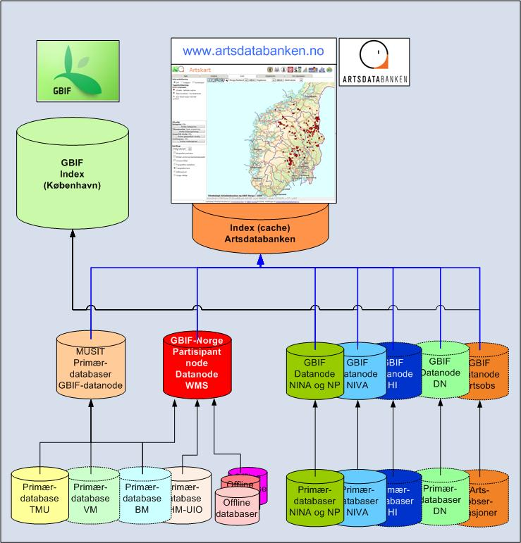

# NBIC and GBIF Norway are distributing occurrence data on species found in Norway for the general public and scientific users.

## Data providers and data types

This map service, provided by NBIC and GBIF Norway (http://www.gbif.no), is distributing data on species found in Norway. More than 30 Norwegian and foreign data providers have processed, adapted and made electronically available spatial species occurrence data from their primary databases. These databases contain data on specimens in natural history collections or observations of species. The data providers and the source databases are listed in Provider Statistics.

## The map service

The Norwegian Biodiversity Information Centre has produced a map client capable of searching for and displaying species occurrence data for both single species and groups of species. In addition to ordinary search functionality, it is possible to choose a species or a group of species by navigating in a hierarchic taxon tree. Where appropriate, Red List and Black List categories for the species are shown with the geographical data. It is also possible to search by Category. Furthermore, data may be filtered by the institution that stores or has digitised the specimen. The year of collection or observation is also available as a parameter for searching or sorting.
Most data points are tagged with precision data and these are available for users of this map service. Each data point is also tagged with information such as in which collection the specimen is stored or digitised, the primary database which made the data available, the date of collection or observation, the name of the collector or observer and the name of the validator of the identification of the species.

## Data flow

Fig. 1. Dataflow from primary provider databases to the Species Map Service and GBIFs Dataportal

## Groups of species, incompleteness and quality

The groups of species which are represented with data are shown in a table on the home page. Depending on funding, the Norwegian Biodiversity Information Centre (NBIC) and GBIF Norway, in cooperation with the owners of the data, will continuously make data for new groups of species available and supplement those groups of species that are incompletely represented. The potential data are probably more than twice the number of objects that appear in the service now. However, digitisation of data is a demanding task, and about 55 % of university museum collections, for example, are not yet digitised.

Users of this species map service must note that the data are incomplete. The service currently covers 60 % of the approximately 41 000 species known to occur in Norway, but does not contain all the existing data on each of the species included. The owners of the data are, as far as their resources allow, constantly digitising data and making them accessible to this service through their primary databases.

Even in well-documented groups of species, the data may be incomplete or even non-existent for some species within the group. Many groups of species are also incompletely mapped in Norway as a whole or in parts of the country. The service shows the mapping data available at present. Absence of data on a species at a certain geographical location does not necessarily imply that the species is not there; the area may not have been studied or the data are not digitised and made available. This means that species occurrences shown in the map service are the currently available documented and digitised data.

Some data are old and may not represent the current situation at the locality unless the site has been recently resurveyed and the species was found again. Information on surveys with negative observations (meaning that the species was not found at the site) is not available in this service.

NBIC, GBIF Norway and the owners of the data have also decided to give access to incomplete and some poorer quality data sets. However, the quality of species identification and the accuracy of the geographical information are documented for users to see.

## Sensitive data

Data for a few species are treated as sensitive. Precise locality information is withheld and the data point is generalised to the centre of a municipality or the centre of a fixed grid (10x10 km or larger). The name of the locality is in addition made unavailable for these data points. This practice is in accordance with §24 of the Freedom of Information Act.

Species covered by this practice are those which botanists and botanical organisations in Norway, together with GBIF Norway, have agreed to treat as sensitive. Such data are available here for the following species:
Fly orchid (Ophrys insectifera, L.)
Musk orchid (Herminium monorchis, (L.)R.Br.)
European lady’s-slipper (Cypripedium calceolus, L.)
Red helleborine (Cephalanthera rubra, (L.) Rich.)
The orchid Lysiella oligantha, (Turcz.) Nevski
The orchid Nigritella nigra, (L.) Rchb.f.
The lichen Erioderma pedicellatum, (Hue) P.M. Jørg.

Tromsø University Museum has also chosen to treat some more species of plants as sensitive. The precise locality information is made unavailable to this service by the owners of the primary data source.

Sensitive locality data for mammals and birds are treated in accordance with the guidelines specified by the Norwegian Directorate for Nature Management (DN). These data will in due time be available through an authentication based service from DN.

## Organisation of the species map service

The species map service is mainly a decentralised network of large GBIF data nodes which provide data through their primary databases. In these databases, the data are encoded in accordance with a Norwegian edition of the international encoding standard for sharing information on biological diversity (Darwin Core 2). The GBIF data nodes publish species data online in a web service. These web services provide data directly from the primary databases for display in this map client. The service is built upon the principles and technology used in Norway Digital. This technology enables us to provide data directly from the primary source without copying them first. New discoveries, updates and updating made in the node database are therefore automatically displayed in the map service. The GBIF data nodes also publish the data directly in the open, international GBIF network.

Species Map Service is provided by the Norwegian Biodiverstiy Information Centre and GBIF-Norway © 2007-2019. Feedback goes to artskart@artsdatabanken.no
