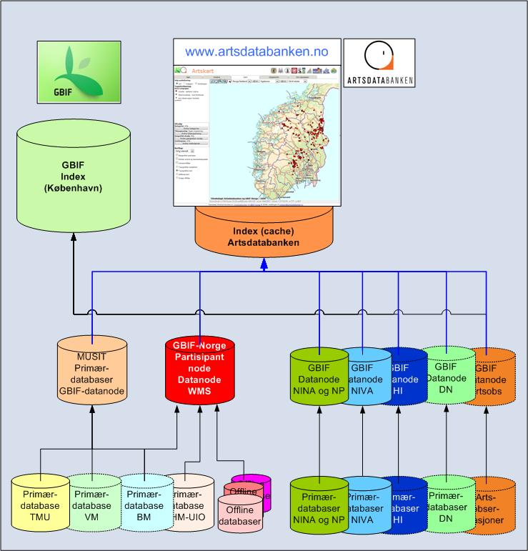

# Artsdatabanken og GBIF-Norge deler sammen med dataeierne geografiske data om norske arter for publikum, skoler, forvaltningen, interesseforeninger og forskere.

## Datakilder og datatyper

I denne tjenesten har Artsdatabanken og GBIF-Norge (den norske noden av the Global Biodiversity Information Facility, http://www.gbif.no) laget en karttjeneste på internett med funn av norske arter. I tjenesten har dataeiere kvalitetssikret, bearbeidet, tilrettelagt og gjort elektronisk tilgjengelig artsfunn fra sine primærdatabaser. Primærdatabasene i institusjonene inneholder data om fysiske objekter (belegg i naturhistoriske samlinger) eller observasjoner (krysslister, notater, toktdata, stasjonsdata, registeringer, litteratur m.v). De institusjonene som deler data i Artskart er listet opp under arkfanen Tilbyder statistikk. Her er også alle databasene listet opp.

## Artsgrupper, ufullstendighet og kvalitet

I bruken av denne artskarttjenesten må brukerne være klar over at artsdataene er ufullstendige. Tjenesten omfatter foreløpig bare 70 % av kjente norske arter og omfatter heller ikke alle data om hver enkelt art. Institusjonene har foreløpig ikke hatt kapasitet eller tilstrekkelig finansiering til å tilrettelegge og kvalitetssikre alle datasett i sine primærdatabaser. For mange artsgrupper er derfor ikke dataene fullstendige hverken geografisk eller når det gjelder alle arter innen gruppene. Mange artsgrupper er ufullstendig kartlagt i Norge og mange områder i landet er ikke undersøkt like godt. På kartet vises det som er tilgjengelig pr. dato. At det ikke finnes artslokalisering på geografiske områder behøver ikke bety at arten ikke finnes der. Manglende artsfunn kan betyr at arten ikke finnes der, at området ikke er undersøkt eller at artsfunnene ikke er digitalisert og gjort tilgjengelig. Det er de dokumenterte, digitaliserte og tilgjengelige opplysningene som viser artenes forekomster i denne karttjenesten. Noen artsfunn er gamle, hvis ikke lokaliteten er kartlagt på nytt i nyere tid, kan faktisk arten være forsvunnet på kjente lokaliteter. Slike opplysninger er ikke dokumentert i denne tjenesten.

Artsdatabanken, GBIF-Norge og dataeierne har valgt å vise fram artsfunn selv om ikke alle datasettene er fullstendige eller har like høy kvalitet. Det er imidlertid lagt vekt på at kvaliteten i artsbestemmelsen, etterprøvbarheten av opplysningene og den geografiske nøyaktighet er dokumentert for brukerne.

## Kartklienten

Artsdatabanken har laget en artskartklient med funksjonalitet for å søke og vise artene på kart. I tjenesten kan brukerne søke og vise både enkeltarter og artsgrupper. Artene kan også søkes fram ved avkryssing i et hierarkisk artstre. De fleste artsdata er kodet med rødlistestatus, herunder også de artene som ikke er på rødlista. Det er lagt til rette for å søke på fremmede arter og deres status. Brukeren kan velge å bruke rødliste- og svartelistekategoriene i utvalget. Brukeren kan også velge ut artsdata ut fra hvilken institusjon som har objektene i sine samlinger eller databaser. Årstallet objektet er funnet eller observasjonen er gjort kan det også sorteres på, slik at gamle objekter kan skjules i kartet. De aller fleste artsdataene er kodet med geografisk presisjon og brukeren kan se nøyaktigheten av stedfestingen av de artene han har valgt. Bak alle prikkene på kartet kan brukeren se en rekke opplysninger; bl.a. hvem som har objektet eller datasettet i sine registre, hvilken primærdatabase det ligger i, funndato, finner og den som har validert artsbestemmingen av objektet.

## Sensitive arter

For noen arter med sensitiv lokalisering er den nøyaktige stedfestingen av koordinatene generalisert til kommunemidtpunkt og lokalitetsnavnet er gjort utilgjengelig, dette er arter som det botaniske fagmiljøet og GBIF-Norge mener bør unntas offentlighet. I de datasettene som er tilgjengelige gjelder dette følgende arter: Flueblom, honningblom, marisko, rød skogfrue, sibirnattfiol, svartkurle og trønderlav. I tillegg til disse artene har Tromsø Museum valgt å skjule den nøyaktige lokaliseringen på noen funnlokaliteter for noen flere arter.

Sensitiv lokalitetsinformasjon for artene er behandlet i samsvar med gjeldende retningslinjer. De artene der nøyaktige lokaliteter skjermes er: Brunbjørn (hi), ulv (hi), gaupe (hi) og jerv (hi), hekkelokaliteter for vepsevåk, fjellvåk, myrhauk, hønsehauk, sivhauk, kongeørn, fiskeørn, havørn, lerkefalk, jaktfalk, vandrefalk, hubro, snøugle, lappugle og slagugle, dverggås, sædgås og lappfiskand, samt myteområder for de to sistnevnte. Retningslinjene for håndtering av sensitiv artsinformasjon er under revidering. Data om sensitive arters funnsted vil senere bli tilgjengelige i en sikker autentiseringsbasert distribusjonstjeneste fra Miljødirektoratet.

## Organisering av tjenesten

Tjenesten er organisert slik at mange av de større dataeierne selv legger ut data fra sine primærdatabaser og etablerer en GBIF-datanode. I nodedatabasen er dataene kodet i samsvar med en norsk utgave av en internasjonal kodestandard for utveksling av artsdata (Darwin Core). Den som driver GBIF-datanoden publiserer artsdataene på nettet i en webservice. Disse webservicene leses av kartklienten i Artsdatabanken direkte fra nodedatabasene. Tjenesten er bygt på prinsippene og teknologien som anvendes i Norge Digitalt. Denne kommunikasjonsteknologien gjør at dataene kommer direkte fra kilden uten at de behøver kopieres. Dette innebærer dermed at nye funn, oppdateringer og ajourhold som legges inn i nodedatabasen automatisk vises i kartsøket. Fra GBIF-datanodene blir dataene også publisert direkte i det åpne, internasjonale GBIF-nettverket http://data.gbif.org/og vil dermed være tilgjengelig for forskere i alle land.

Fig. 1. Dataflyt fra primærdatabaser hos dataeier til Artskart og GBIFs dataportal

Tjenesten Artskart 1.6 leveres av Artsdatabanken og GBIF-Norge © 2007-2019. Tilbakemeldinger sendes til artskart@artsdatabanken.no
